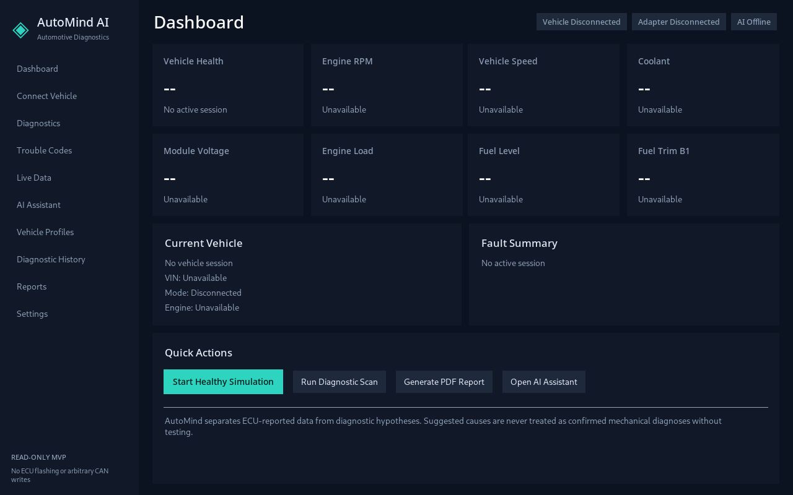
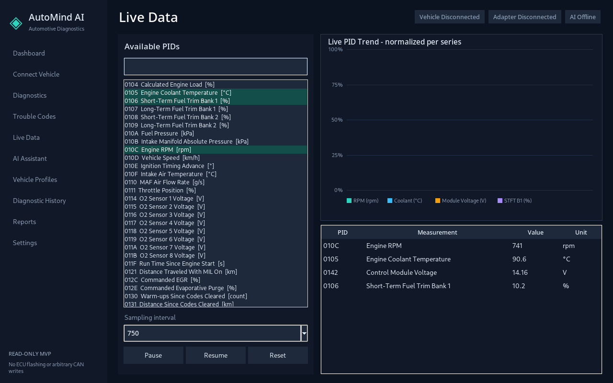

# AutoMind AI

**AutoMind AI 0.1.0 MVP** is a real Windows desktop automotive diagnostic assistant focused on safe, read-oriented OBD-II diagnostics, deterministic local reasoning, diagnostic history, live data, professional PDF reports, and optional cloud AI analysis.

> AutoMind AI is a diagnostic assistant. It does not replace qualified inspection, manufacturer service information, or professional repair procedures. Mechanical causes shown by the software are hypotheses until verified by testing.

## Product goals

AutoMind AI turns raw OBD-II data into a structured diagnostic workflow:

`Vehicle -> ELM327 adapter -> OBD communication -> data normalization -> local diagnostic rules -> optional AI reasoning -> desktop UI / reports`

The application intentionally separates:

- **Observed / confirmed data**: ECU-reported DTCs, measured PIDs, freeze-frame values, adapter state.
- **Possible diagnostic causes**: local rule-engine hypotheses and optional AI reasoning.

## Screenshots

### Dashboard — Simulation Mode



### Live Data



## Current MVP features

- Windows 11 x64 desktop application
- Read-focused ELM327 USB/serial architecture
- Serial-port discovery and adapter selection
- Connect, disconnect and reconnect using the saved adapter configuration
- Stored DTCs (Mode 03)
- Pending DTCs (Mode 07)
- Permanent DTCs where supported (Mode 0A)
- VIN retrieval where supported (Mode 09 PID 02)
- Supported-PID discovery
- Freeze-frame reads where supported
- Live data monitoring with selectable PIDs
- Live graphing, pause/resume/reset, sampling interval selection
- Ten built-in simulation scenarios
- Local deterministic diagnostic rule engine
- DTC knowledge base with causes, symptoms, checks, related PIDs
- SQLite vehicle profiles and diagnostic history
- Persistent live-data snapshots
- Editable technician/user notes per diagnostic session
- PDF health reports
- Generated-report history with reopen support
- Optional cloud AI through a separate AutoMind backend
- VIN and session-note privacy controls plus payload sanitization
- Minimal same-vehicle DTC history context for optional cloud AI reasoning
- Local logging
- First-run setup wizard
- Prepared plugin interface for future licensed/documented integrations
- Windows PyInstaller + Inno Setup production build pipeline
- GitHub Actions Windows build workflow

## Simulation Mode

Simulation Mode is always clearly labeled and never presented as real vehicle data.

Included scenarios:

1. Healthy Vehicle
2. Cylinder 2 Misfire
3. Rich Fuel Mixture
4. Lean Fuel Mixture
5. Engine Overheating
6. Weak Battery / Charging Problem
7. Oxygen Sensor Fault
8. MAF Sensor Fault
9. Catalyst Efficiency Fault
10. Random Multiple Misfire

## Supported live PIDs in V1

AutoMind includes decoders for these standard Mode 01 PIDs when the vehicle supports them:

| PID | Measurement |
|---|---|
| 0104 | Calculated engine load |
| 0105 | Coolant temperature |
| 0106 | STFT Bank 1 |
| 0107 | LTFT Bank 1 |
| 010A | Fuel pressure |
| 010B | MAP |
| 010C | Engine RPM |
| 010D | Vehicle speed |
| 010E | Ignition timing advance |
| 010F | Intake air temperature |
| 0110 | MAF air flow |
| 0111 | Throttle position |
| 0114 | Upstream O2 sensor voltage representation |
| 011F | Runtime since engine start |
| 012F | Fuel level |
| 0142 | Control-module voltage |
| 0146 | Ambient air temperature |

Unsupported or unavailable ECU values are displayed as **Not Supported** or **Unavailable**. AutoMind does not invent missing vehicle measurements.

## Safety boundary

Version 0.1.0 intentionally does **not** expose:

- ECU flashing/reprogramming
- arbitrary CAN-frame transmission
- immobilizer/security bypass
- odometer modification
- airbag/ABS/braking/steering modification
- ECU firmware updates
- silent DTC clearing

The current product is for **diagnosis and analysis**, not vehicle modification.

## Technology

- Python 3.12 for production build
- Tk / ttk desktop UI for the MVP
- pyserial for real ELM327 serial transport
- SQLite for local storage
- ReportLab for PDF reports
- FastAPI reference backend for optional cloud AI
- PyInstaller for `AutoMindAI.exe`
- Inno Setup for `AutoMindAI-Setup.exe`

### Why Tk/ttk instead of PySide6 in this MVP?

PySide6 was considered. The MVP uses Tk/ttk because it is bundled with CPython, materially reduces the number and size of production GUI dependencies, works well with PyInstaller, and gives a reliable native Windows widget base. The UI layer is isolated so a future PySide6/Qt shell can replace it without changing OBD, diagnostics, database, simulator, AI, or report modules.

## Project structure

```text
AutoMindAI/
├─ ai/                  # AI provider abstraction, sanitization, response parsing
├─ app/                 # Application controller and version metadata
├─ assets/              # Original AutoMind icons / version resources
├─ backend/             # Reference cloud backend (provider key stays server-side)
├─ core/                # Paths, configuration, units, event bus
├─ database/            # SQLite repository
├─ diagnostics/         # Local deterministic rules
├─ docs/                # Architecture and technical documentation
├─ installer/           # Inno Setup installer script
├─ knowledge/           # Local DTC / PID knowledge
├─ logging_ext/         # Structured local logging
├─ obd/                 # ELM327 transport, protocol parsers and client
├─ plugins/             # Future plugin contracts
├─ reports/             # PDF report generation
├─ samples/             # Generated simulation sessions and sample PDF
├─ scripts/             # Windows build and development scripts
├─ simulator/           # Vehicle simulator scenarios
├─ tests/               # Automated tests
├─ ui/                  # Windows desktop UI
├─ vehicle/             # Domain models
├─ AutoMindAI.spec      # PyInstaller definition
├─ main.py              # Application entry point
└─ requirements*.txt
```

## Run from source on Windows

```powershell
py -3.12 -m venv .venv
.\.venv\Scripts\Activate.ps1
python -m pip install -r requirements.txt
python main.py
```

Simulation Mode works without an OBD adapter.

## Production Windows build

Install Python 3.12 and Inno Setup 6 on the build machine, then run:

```powershell
.\scripts\build_windows.ps1
```

The script:

1. creates an isolated virtual environment,
2. installs build dependencies,
3. runs the automated tests,
4. builds `dist\AutoMindAI.exe`,
5. runs the packaged executable self-test,
6. builds `dist\installer\AutoMindAI-Setup.exe`,
7. silently installs the generated installer into a temporary directory,
8. runs the installed executable self-test,
9. silently uninstalls it,
10. verifies removal of the installed executable.

The Windows GitHub Actions workflow performs the same build on `windows-latest` and uploads both executables as an artifact.

See [`docs/BUILD_WINDOWS.md`](docs/BUILD_WINDOWS.md) and [`docs/QA.md`](docs/QA.md).

## AI configuration

The Windows application does **not** embed the master AI-provider API secret.

Recommended production flow:

`AutoMindAI.exe -> HTTPS AutoMind backend -> AI provider`

The desktop sends a sanitized diagnostic context. VIN is excluded unless the user explicitly enables VIN transmission.
Session notes are also excluded from cloud AI context unless separately enabled in Privacy settings.

See [`docs/AI.md`](docs/AI.md) and [`docs/SECURITY.md`](docs/SECURITY.md).

## Data locations on Windows

Writable data is stored outside Program Files:

- Database: `%LOCALAPPDATA%\AutoMindAI\automind.db`
- Settings: `%LOCALAPPDATA%\AutoMindAI\settings.json`
- Logs: `%LOCALAPPDATA%\AutoMindAI\Logs\`
- Reports: `%USERPROFILE%\Documents\AutoMind AI\Reports\`

Uninstalling the program does not intentionally erase diagnostic history or reports.

For the detailed service/PID matrix, see [`docs/SUPPORTED_OBD.md`](docs/SUPPORTED_OBD.md).

## OBD adapter requirements

V1 targets ELM327-compatible adapters over Windows serial/COM transport. USB is the primary tested architecture. Bluetooth adapters that expose a Windows COM port can use the same serial layer, but adapter/driver compatibility varies.

Use a reputable adapter. Many low-quality ELM327 clones report inaccurate firmware identities or have incomplete command support.

## Automated tests

```powershell
python -m pytest -q
python main.py --self-test
```

The test suite covers protocol parsing, simulation, diagnostic rules, database persistence, configuration, AI response parsing/sanitization, reports, and controller integration.

The current source snapshot passes **34 automated tests** plus the packaged-runtime self-test and a headless desktop UI smoke test in the available Linux build environment.

## Known limitations — 0.1.0 MVP

- Standard generic OBD-II only; no manufacturer-specific diagnostics yet.
- No J2534 support yet.
- No native BLE adapter stack yet.
- DTC knowledge base is curated for the MVP and is not a replacement for OEM service information.
- Some ELM327 clones behave differently from genuine/reputable adapters.
- O2 PID representations vary by protocol/vehicle; V1 only decodes the common narrow-band representation used by PID 14.
- Freeze-frame availability varies significantly by ECU.
- Cloud AI requires a configured AutoMind backend and Internet access.
- The provided build is unsigned unless a real code-signing certificate is supplied; Windows SmartScreen may show an unknown-publisher warning.

## Roadmap

- Expanded standards-based DTC knowledge
- Additional Mode 01 decoders
- J2534 transport
- Better Bluetooth/BLE adapter support
- Signed plugin manager with capability permissions
- Manufacturer modules using documented/licensed interfaces
- EV battery-health module
- Predictive maintenance features
- Richer time-series analytics
- Secure user authentication for production backend
- Optional local model provider
- Code signing and release automation

## License

No open-source license is selected in this MVP repository. Until a license is explicitly added by the project owner, treat the source as **all rights reserved** and do not assume redistribution or sublicensing rights.
